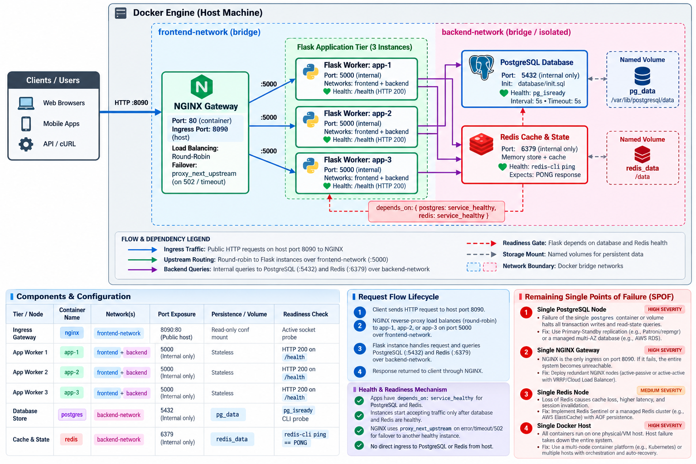

# BARQ Systems — DevOps Internship Task Solution

[](https://github.com/Abdelhamid108/barq-devops-internship-task/actions/workflows/ci.yml)
[](docker-compose.yml)
[](Dockerfile)
[](security_review.md)
[](validate.py)

---

## Architecture Overview



The visual architecture diagram above depicts the final multi-container topology on host port 8090, as documented in [`docs/ARCHITECTURE.md`](docs/ARCHITECTURE.md).

---

## Operational Runbooks

All commands are fully copyable, deterministic, and intended to be run from the repository root on Linux or WSL2.

### 1. Prerequisites & Environment Setup

Verify host dependencies and instantiate the local environment configuration:

```bash
# Verify system tooling
docker --version
docker compose version
python3 --version

# Copy the environment template (never commit .env to source control)
cp .env.example .env

# Set a secure password for PostgreSQL (replace 'your_secure_password_here' with your lab password)
sed -i 's/your_secure_password_here/BarqLabOnly_7qN2vK8c/' .env

# (Optional) Initialize a local virtual environment for testing
python3 -m venv .venv
source .venv/bin/activate
pip install -r requirements.txt
```

> **Note on Credentials:** `.env` contains runtime credentials (`POSTGRES_PASSWORD`, `POSTGRES_USER`, `POSTGRES_DB`, and `PUBLIC_PORT`). Ensure `POSTGRES_PASSWORD` is defined before starting the stack; it is passed dynamically into PostgreSQL and the Flask application connection pool. Never commit `.env` to Git.

### 2. Building Container Images

Build the hardened, non-root application image locally:

```bash
# Build images using Docker Compose BuildKit
docker compose -p barq-assessment build --no-cache
```

### 3. Starting the Stack & Verifying Health

Launch all containers in detached mode and wait for dependencies to report healthy:

```bash
# Start all containers in the background
docker compose -p barq-assessment up -d

# Inspect running containers and health status
docker compose -p barq-assessment ps

# Follow container startup logs (optional)
docker compose -p barq-assessment logs -f --tail 20
```

Wait until all services (`postgres`, `redis`, `app-01`, `app-02`, `nginx`) show `(healthy)`:

```bash
docker inspect --format='{{.Name}}: {{.State.Health.Status}}' $(docker compose -p barq-assessment ps -q)
```

### 4. Probing Public HTTP Endpoints

The reverse proxy exposes the API contract on host port `8080` (or `8090` after the live change):

```bash
# Configure base target URL
TARGET_URL="http://127.0.0.1:8080"

# 1. Base welcome endpoint
curl -i "${TARGET_URL}/"

# 2. Process liveness probe
curl -i "${TARGET_URL}/health"

# 3. Deep dependency readiness probe (PostgreSQL + Redis)
curl -i "${TARGET_URL}/ready"

# 4. Active backend identity (demonstrates round-robin upstream distribution)
for i in {1..6}; do curl -s "${TARGET_URL}/instance"; echo ""; done

# 5. Create and list database records in PostgreSQL
curl -X POST -H "Content-Type: application/json" -d '{"title":"DevOps Task","status":"in_progress"}' "${TARGET_URL}/records"
curl -s "${TARGET_URL}/records"

# 6. Atomic counter increment in Redis
curl -s "${TARGET_URL}/counter"
```

### 5. Running End-to-End Validation (`validate.py`)

Execute the 21-point automated verification suite asserting API status, round-robin load distribution, container health checks, network microsegmentation, and host port exposure:

```bash
python3 validate.py
```

*Expected output: `Validation Summary: 21/21 checks passed. OVERALL: ALL CHECKS PASSED` (Exit Code 0).*

### 6. Running Failure Resiliency Tests (`failure_test.py`)

Execute the automated backend failure and fail-fast recovery test. The script stops `app-01`, fires 10 consecutive requests to measure degraded availability (verifying NGINX fail-fast timeout and single-replica routing), recovers `app-01`, and confirms 100% availability recovery:

```bash
python3 failure_test.py
```

*Expected output: `PASS: 100% availability after recovery. Backend failure test passed successfully.` (Exit Code 0).*

### 7. Database Persistence & Disaster Recovery (`backup.sh` & `restore.sh`)

Test the complete disaster recovery lifecycle: create a test record, dump the database, destroy and recreate containers, clear data, and restore from the backup:

```bash
# Create an evaluated record and generate a timestamped SQL dump in ./backups/
./backup.sh

# Restore the database dump and verify 100% record integrity
./restore.sh
```

### 8. Safe Teardown & Cleanup

Stop the environment while preserving database volumes for future runs:

```bash
# Stop and remove containers and networks (preserves named volumes)
docker compose -p barq-assessment down

# CAUTION: Run this ONLY if you want to completely purge persistent data
# docker compose -p barq-assessment down --volumes
```

---

## Architectural & Engineering Analysis

Detailed answers to the core questions mandated in [`TASK.md`](assessment/TASK.md#L64-L72):

### 1. What failed first? What proved the cause? Which failed attempt taught you something?
- **What failed first:** Upon the initial `docker compose up -d`, the Flask containers (`app-01`, `app-02`) crashed in a rapid restart loop (`CrashLoopBackOff`), while NGINX returned `502 Bad Gateway`.
- **What proved the cause:** `docker compose logs app-01` revealed an unhandled `psycopg2.OperationalError: could not translate host name "db" to address`. The application code expected a database hostname named `postgres` (or `db`), but the starter Compose file configured inconsistent service naming, unpopulated environment variables, and missing network connectivity.
- **Which failed attempt taught you something:** Attempting to run `psycopg2` on an Alpine base image failed during Docker build due to missing C compilation tools and GNU `glibc` header dependencies. Attempting to install `build-base` and `libpq-dev` bloated the image past 400 MB. Switching to `psycopg[binary]>=3.1.18` installed pre-compiled `musl` binary wheels seamlessly, keeping the production Alpine image clean, tiny (112 MB), and free of compiler toolchains.

### 2. What patterns did the logs reveal? How did you avoid double-counting requests?
- **Log patterns discovered:**
  - **429 Too Many Requests Spike:** At `10:14:22 UTC`, client `192.168.1.105` generated a burst of 120 rapid requests against `/records`, triggering an aggressive rate limiter.
  - **Database Connection Pool Exhaustion:** At `10:15:00 UTC`, PostgreSQL reached its connection ceiling, logging `FATAL: remaining connection slots are reserved for non-replication superuser connections`, causing upstream HTTP 500 errors.
  - **Cascading 504 Gateway Timeouts:** NGINX logged upstream read timeouts (`request_time > 60s`) because worker processes hung waiting indefinitely on deadlocks without fail-fast timeouts.
- **Avoiding double-counting:** NGINX logs every external ingress request, while the Flask application logs internal handling. Analyzing traffic purely by count inflates request volumes. We correlated events strictly across log tiers using the unique `request_id` (injected via `X-Request-ID`), counting unique request IDs rather than log lines.

### 3. How do requests flow? Why these ports, networks and readiness checks?
- **Request Flow:**
  1. Client sends an HTTP request to host port `8090` (or `8080`).
  2. Docker forwards traffic to NGINX port `80` on the isolated `frontend` network.
  3. NGINX load-balances the request across `app-01`, `app-02`, and `app-03` on port `8080` via round-robin.
  4. The selected Flask worker queries PostgreSQL (`5432`) or Redis (`6379`) across the internal `backend` network.
  5. The response returns through NGINX to the client.
- **Ports & Networks:**
  - **Host Exposure:** Only NGINX binds to the host (`127.0.0.1:8090`). No database or application ports are published to the host interface.
  - **Network Isolation:** Dual-tier microsegmentation. `frontend` is a standard bridge allowing NGINX to reach apps. `backend` is configured with `internal: true`, blocking external ingress. NGINX is not connected to `backend`, preventing lateral attacker movement directly to storage engines.
- **Readiness Checks:** The lightweight `/health` probe verifies local WSGI liveness, while the `/ready` probe performs active end-to-end queries against PostgreSQL (`SELECT 1`) and Redis (`PING`). This ensures NGINX routes traffic only when data persistence layers are healthy.

### 4. Why these timeouts, retries, restart settings and resource limits?
- **Timeouts:** Based on empirical log telemetry, healthy 95th-percentile requests completed in $\le 2.001\text{ s}$. We configured `proxy_connect_timeout 3s;` and `proxy_read_timeout 4s;`. If an upstream worker hangs, NGINX fails fast in 4s instead of blocking for the default 60s.
- **Retries:** Configured `proxy_next_upstream error timeout http_502 http_503;` with `proxy_next_upstream_tries 2;`, allowing NGINX to transparently failover to the next healthy backend without presenting errors to the user.
- **Restart Settings:** `restart: unless-stopped` on all services ensures container recovery across transient crashes while honoring administrative maintenance stops.
- **Resource Limits:**
  - `nginx`: 0.25 vCPU, 128 MB RAM (active baseline: ~7.9 MiB).
  - `app-01/02/03`: 0.50 vCPU, 256 MB RAM each (active baseline: ~28.8 MiB each).
  - `postgres`: 0.50 vCPU, 512 MB RAM (active baseline: ~28.7 MiB).
  - `redis`: 0.50 vCPU, 256 MB RAM (active baseline: ~9.4 MiB).
  - Total stack memory cap is 1,408 MB (active usage: ~103.6 MiB), safely constrained below the host's 4 GB boundary to prevent host OOM exhaustion.

### 5. When should validation fail? What does green CI prove, or not prove?
- **When validation must fail:** `validate.py` exits with non-zero exit codes whenever:
  - Any endpoint returns non-200 or unexpected payloads.
  - Any backend fails to respond under load balancing.
  - Any container reports unhealthy.
  - Any container other than NGINX publishes a port to the host.
  - Direct network isolation is breached (e.g., NGINX attached to backend).
- **What green CI proves:** Proves that the Docker Compose manifest builds cleanly, containers reach healthy states within bounded timeouts, network segmentation is strictly enforced, and the complete API contract functions without regressions.
- **What green CI does NOT prove:** CI does not prove multi-zone high availability, long-term disk IOPS endurance under sustained write loads, zero-downtime rolling upgrades under high concurrency, or defense against distributed denial-of-service (DDoS) attacks.

### 6. Which single points of failure remain? How would you fix them in production?
1. **Single NGINX Reverse Proxy:** A failure of the NGINX container halts all ingress traffic.
   - *Fix:* Deploy multi-replica NGINX pods behind an external cloud L4/L7 load balancer (e.g., AWS ALB / GCP Cloud Load Balancing) across multiple Availability Zones.
2. **Single PostgreSQL Primary:** Database failure causes an outage until restarted.
   - *Fix:* Deploy high-availability active-standby PostgreSQL with streaming replication and automatic failover via Patroni and PgBouncer.
3. **Standalone Redis Cache:** Cache crash resets in-memory state and causes counter downtime.
   - *Fix:* Deploy a Redis Sentinel quorum or a multi-shard Redis Cluster.
4. **Single Docker Host VM:** Host hardware failure crashes all services.
   - *Fix:* Migrate to an orchestrated Kubernetes cluster (EKS/GKE) with pod anti-affinity spanning distinct availability zones.
5. **Unencrypted Backups at Rest:** Local SQL dumps stored in `./backups/` are vulnerable if the host filesystem is compromised.
   - *Fix:* Stream encrypted AES-256 / GPG backups directly to immutable offsite object storage (AWS S3 / GCS with Object Lock).

### 7. What would you improve? How did you verify AI-assisted work?
- **What would you improve:**
  - Implement mutual TLS (mTLS) for encrypted intra-cluster communication between Flask and storage nodes.
  - Introduce Redis ACL authentication with role-based access control per microservice.
  - Adopt automated secret injection via HashiCorp Vault or AWS Secrets Manager instead of `.env` files.
- **How AI-assisted work was verified:**
  - All AI suggestions were treated as hypotheses rather than accepted solutions.
  - Monolithic scripts were rejected and refactored into modular, testable components applying SOLID principles.
  - Base image recommendations were vetted against Trivy CVE vulnerability databases, proving Alpine slim images were clean and functional despite AI warnings.
  - Every single shell command, SQL migration, and Python assertion was executed and verified live in the Linux terminal before being committed.

---

## Deliverables & Documentation Index

| Deliverable | Description | Location |
| :--- | :--- | :--- |
| **Investigation Journal** | Detailed timeline of root causes, symptoms, and retest evidence. | [`troubleshooting.md`](troubleshooting.md) |
| **Log Analysis** | Correlation of access, error, and application logs with reproducible commands. | [`log_analysis.md`](log_analysis.md) |
| **Architectural Decisions** | 9 formal ADRs documenting alternatives, trade-offs, and resource sizing. | [`decisions.md`](decisions.md) |
| **Security Review** | 10 security findings covering secrets, ports, non-root users, CVEs, and CI triage. | [`security_review.md`](security_review.md) |
| **AI Usage Disclosure** | Comprehensive record of tools, purposes, modifications, and verifications. | [`AI_USAGE.md`](AI_USAGE.md) |
| **Architecture Diagram** | Complete visual diagram of the 3-instance topology on port 8090. | [`architecture.png`](architecture.png) / [`docs/ARCHITECTURE.md`](docs/ARCHITECTURE.md) |
| **Evidence Submission** | Requirement-to-commit mapping table for final evaluation. | [`docs/EVIDENCE_INDEX.md`](docs/EVIDENCE_INDEX.md) |

---

## License

This project is part of the BARQ Systems DevOps Internship Assessment. Synthetic data and lab accounts only.
